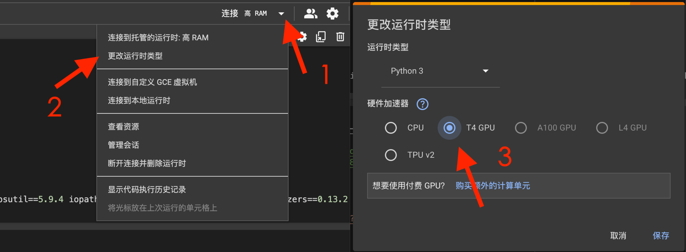

# 《Prompt Compression and Query Optimization》 Colab 笔记本

## 简介

本仓库包含适用于 《Prompt Compression and Query Optimizationt》 课程的 Google Colab 笔记本。有关课程的更多信息，请访问课程链接：[Prompt Compression and Query Optimization](https://learn.deeplearning.ai/courses/prompt-compression-and-query-optimization/lesson/1/introduction)。

## 课程目录

| 课程目录               | GPT-4o详细中文注释                                                                                                                                            | 英文注释                                                                                                                                                  |
|----------------------|---------------------------------------------------------------------------------------------------------------------------------------------------------|-------------------------------------------------------------------------------------------------------------------------------------------------------|
| Introduction         |                                                                                                                                                         |                                                                                                                                                       |
| Vanilla Vector Search|  |  |
| Filtering With Metadata |  |  |
| Projections         |  |  |
| Boosting            |  |  |
| Prompt Compression   |  |  |
| Conclusion          |                                                                                                                                                         |                                                                                                                                                       |
| Appendix-Tips and Help |                                                                                                                                                         |                                                                                                                                                       |

## 使用方法

1. 打开您想运行的笔记本。
2. 根据需求更改运行时类型，请按照以下步骤操作：
   - 点击右上角的按钮（如下图中的 1 所示）。
   - 从下拉菜单中选择“更改运行时类型”（如图中的 2 所示）。
   - 在运行时类型选择窗口中，选择您想要的硬件加速器（如图中的 3 所示），然后点击“保存”。

   

3. 按照笔记本中提供的指示执行单元并测试模型。
