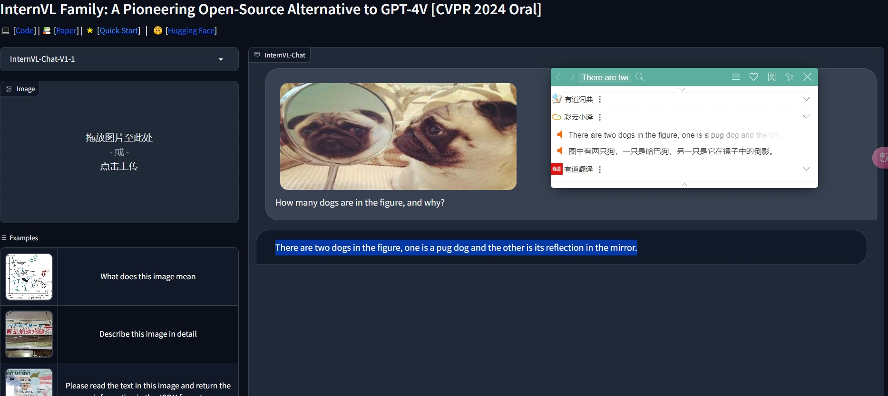
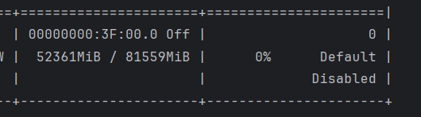

# InternVL Colab Notebooks

## Introduction

This repository contains Google Colab notebooks for running different models of InternVL, which enhance vision-language understanding using advanced large language models. For more information on the original models, refer to the InternVL papers and the [official GitHub repository](https://github.com/OpenGVLab/InternVL).

- **[InternVL: Scaling up Vision Foundation Models and Aligning for Generic Visual-Linguistic Tasks](https://arxiv.org/abs/2312.14238)**
- **[How Far Are We to GPT-4V? Closing the Gap to Commercial Multimodal Models with Open-Source Suites](https://arxiv.org/abs/2404.16821)**
- **[InternVL2: Better than the Best—Expanding Performance Boundaries of Open-Source Multimodal Models with the Progressive Scaling Strategy](https://internvl.github.io/blog/2024-07-02-InternVL-2.0/)**

## Notebooks

### InternVL-1.5

| Notebook | Open in Colab |
|----------|---------------|
| [Mini-InternVL-Chat-2B-V1-5-demo.ipynb](InternVL-1.5-colab/Mini-InternVL-Chat-2B-V1-5-demo.ipynb) |  |
| [Mini-InternVL-Chat-4B-V1-5-demo.ipynb](InternVL-1.5-colab/Mini-InternVL-Chat-4B-V1-5-demo.ipynb) |  |

### InternVL-2.0

| Notebook | Open in Colab |
|----------|---------------|
| [InternVL2-1B-demo.ipynb](InternVL-2.0-colab/InternVL2-1B-demo.ipynb) |  |
| [InternVL2-2B-demo.ipynb](InternVL-2.0-colab/InternVL2-2B-demo.ipynb) |  |
| [InternVL2-4B-demo.ipynb](InternVL-2.0-colab/InternVL2-4B-demo.ipynb) |  |

## Model Memory Usage

### InternVL-1.0

| Model                                    | 🤗 Hugging Face                                                               | Memory Usage       |
|------------------------------------------|-------------------------------------------------------------------------------|--------------------|
| InternVL-Chat-V1-1                       | [Hugging Face](https://huggingface.co/OpenGVLab/InternVL-Chat-V1-1)            | 38657MiB memory    |
| InternVL-Chat-V1-2                       | [Hugging Face](https://huggingface.co/OpenGVLab/InternVL-Chat-V1-2)            | 78471MiB memory    |
| InternVL-Chat-V1-2-Plus                  | [Hugging Face](https://huggingface.co/OpenGVLab/InternVL-Chat-V1-2-Plus)       | 78391MiB memory    |
| InternVL-Chat-ViT-6B-Vicuna-7B           | [Hugging Face](https://huggingface.co/OpenGVLab/InternVL-Chat-ViT-6B-Vicuna-7B)| 26525MiB memory    |
| InternVL-Chat-ViT-6B-Vicuna-13B          | [Hugging Face](https://huggingface.co/OpenGVLab/InternVL-Chat-ViT-6B-Vicuna-13B)| 37181MiB memory    |

### InternVL-1.5

| Model                                    | 🤗 Hugging Face                                                               | Memory Usage       |
|------------------------------------------|-------------------------------------------------------------------------------|--------------------|
| InternVL-Chat-V1-5                       | [Hugging Face](https://huggingface.co/OpenGVLab/InternVL-Chat-V1-5)            | 5236MiB memory     |
| Mini-InternVL-Chat-4B-V1-5               | [Hugging Face](https://huggingface.co/OpenGVLab/Mini-InternVL-Chat-4B-V1-5)    | 5671MiB memory     |
| Mini-InternVL-Chat-2B-V1-5               | [Hugging Face](https://huggingface.co/OpenGVLab/Mini-InternVL-Chat-2B-V1-5)    | 9339MiB memory     |

### InternVL-2.0

| Model                                    | 🤗 Hugging Face                                                               | Memory Usage       |
|------------------------------------------|-------------------------------------------------------------------------------|--------------------|
| InternVL2-1B                             | [Hugging Face](https://huggingface.co/OpenGVLab/InternVL2-1B)                  | 3239MiB memory     |
| InternVL2-2B                             | [Hugging Face](https://huggingface.co/OpenGVLab/InternVL2-2B)                  | 5675MiB memory     |
| InternVL2-4B                             | [Hugging Face](https://huggingface.co/OpenGVLab/InternVL2-4B)                  | 10023MiB memory    |
| InternVL2-8B                             | [Hugging Face](https://huggingface.co/OpenGVLab/InternVL2-8B)                  | 18195MiB memory    |
| InternVL2-26B                            | [Hugging Face](https://huggingface.co/OpenGVLab/InternVL2-26B)                 | 52365MiB memory    |
| InternVL2-40B                            | [Hugging Face](https://huggingface.co/OpenGVLab/InternVL2-40B)                 | 79135MiB memory    |
## Usage

1. Open the notebook you want to run.
2. To change the runtime type, follow these steps:
   
   - Click on the button in the top right corner (marked as 1 in the image below).
   - Select "Change runtime type" from the dropdown menu (marked as 2 in the image below).
   - In the runtime type selection window, choose the hardware accelerator you want (marked as 3 in the image below) and click "Save".
   
3. Follow the instructions provided in the notebook to execute the cells and test the models.

> **Note:** InternVL uses FlashAttention 2, which requires a compatible GPU such as the L4. If you need to use a T4 GPU, you can refer to the modification in the model's config from the discussion in [InternVL Issue #144](https://github.com/OpenGVLab/InternVL/issues/144). Set `use_flash_attn` to `false` and `attn_implementation` to `eager`.

## Visual Results

### InternVL-1.0

1. **InternVL-Chat-V1-1-demo Page Rendering**

    

2. **InternVL-Chat-V1-1-demo Memory Usage**

    

3. **InternVL-Chat-V1-2-demo Page Rendering**

    

4. **InternVL-Chat-V1-2-demo Memory Usage**

    

5. **InternVL-Chat-V1-2-Plus-demo Page Rendering**

    

6. **InternVL-Chat-V1-2-Plus-demo Memory Usage**

    

7. **InternVL-Chat-ViT-6B-Vicuna-7B-demo Page Rendering**

    

8. **InternVL-Chat-ViT-6B-Vicuna-7B-demo Memory Usage**

    

9. **InternVL-Chat-ViT-6B-Vicuna-13B-demo Page Rendering**

    

10. **InternVL-Chat-ViT-6B-Vicuna-13B-demo Memory Usage**

    

### InternVL-1.5

1. **InternVL-Chat-V1-5-demo Page Rendering**

    

2. **InternVL-Chat-V1-5-demo Memory Usage**

    

3. **Mini-InternVL-Chat-2B-V1-5-demo Page Rendering**

    

4. **Mini-InternVL-Chat-2B-V1-5-demo Memory Usage**

    

5. **Mini-InternVL-Chat-4B-V1-5-demo Page Rendering**

    

6. **Mini-InternVL-Chat-4B-V1-5-demo Memory Usage**

    
7. 
### InternVL-2.0

1. **InternVL2-1B-demo Page Rendering**

    

2. **InternVL2-1B-demo Memory Usage**

    

3. **InternVL2-2B-demo Page Rendering**

    

4. **InternVL2-2B-demo Memory Usage**

    

5. **InternVL2-4B-demo Page Rendering**

    

6. **InternVL2-4B-demo Memory Usage**

    

7. **InternVL2-8B-demo Page Rendering**

    

8. **InternVL2-8B-demo Memory Usage**

    

9. **InternVL2-26B-demo Page Rendering**

    

10. **InternVL2-26B-demo Memory Usage**

    

11. **InternVL2-40B-demo Page Rendering**

    

12. **InternVL2-40B-demo Memory Usage**

    

## License

This project follows the licenses of the original repositories. For more details, please refer to the LICENSE file and the license files in the original repositories.
