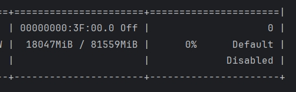

# LLaVA Colab Notebooks

## Introduction

This repository contains Google Colab notebooks for running different models of LLaVA, which enhance vision-language understanding using advanced large language models. For more information on the original models, refer to the LLaVA papers and the [official GitHub repository](https://github.com/haotian-liu/LLaVA).

- **LLaVA: Visual Instruction Tuning** ([arXiv link](https://arxiv.org/abs/2304.08485))
- **LLaVA v1.5: Improved Baselines with Visual Instruction Tuning** ([arXiv link](https://arxiv.org/abs/2310.03744))
- **LLaVA v1.6: LLaVA-NeXT: Improved Reasoning, OCR, and World Knowledge** ([Blog link](https://llava-vl.github.io/blog/2024-01-30-llava-next/))

## Notebooks

### LLaVA v1.5
1. [llava-v1.5-7b-4bit-demo.ipynb](LLaVA-1.5-colab/llava-v1.5-7b-4bit-demo.ipynb)
2. [llava-v1.5-7b-8bit-demo.ipynb](LLaVA-1.5-colab/llava-v1.5-7b-8bit-demo.ipynb)

### LLaVA v1.6
1. [llava-v1.6-mistral-7b-4bit-demo.ipynb](LLaVA-1.6-colab/llava-v1.6-mistral-7b-4bit-demo.ipynb)
2. [llava-v1.6-mistral-7b-8bit-demo.ipynb](LLaVA-1.6-colab/llava-v1.6-mistral-7b-8bit-demo.ipynb)
3. [llava-v1.6-vicuna-7b-4bit-demo.ipynb](LLaVA-1.6-colab/llava-v1.6-vicuna-7b-4bit-demo.ipynb)
4. [llava-v1.6-vicuna-7b-8bit-demo.ipynb](LLaVA-1.6-colab/llava-v1.6-vicuna-7b-8bit-demo.ipynb)

## Model Zoo

| Model                        | 🤗 Hugging Face Link                                                      | Memory Usage        |
|------------------------------|---------------------------------------------------------------------------|---------------------|
| llava-v1.5-7b-4bit           | [Hugging Face](https://huggingface.co/liuhaotian/llava-v1.5-7b)           | 6043MiB  memory     |
| llava-v1.5-7b-8bit           | [Hugging Face](https://huggingface.co/liuhaotian/llava-v1.5-7b)           | 9127MiB  memory     |
| llava-v1.5-7b                | [Hugging Face](https://huggingface.co/liuhaotian/llava-v1.5-7b)           | 15811MiB memory     |
| llava-v1.5-13b               | [Hugging Face](https://huggingface.co/liuhaotian/llava-v1.5-13b)          | 28515MiB memory     |
| llava-v1.6-mistral-7b-4bit   | [Hugging Face](https://huggingface.co/liuhaotian/llava-v1.6-mistral-7b)   | 6063MiB  memory     |
| llava-v1.6-mistral-7b-8bit   | [Hugging Face](https://huggingface.co/liuhaotian/llava-v1.6-mistral-7b)   | 13855MiB memory     |
| llava-v1.6-mistral-7b        | [Hugging Face](https://huggingface.co/liuhaotian/llava-v1.6-mistral-7b)   | 16949MiB memory     |
| llava-v1.6-vicuna-7b-4bit    | [Hugging Face](https://huggingface.co/liuhaotian/llava-v1.6-vicuna-7b)    | 7147MiB  memory     |
| llava-v1.6-vicuna-7b-8bit    | [Hugging Face](https://huggingface.co/liuhaotian/llava-v1.6-vicuna-7b)    | 10651MiB memory     |
| llava-v1.6-vicuna-7b         | [Hugging Face](https://huggingface.co/liuhaotian/llava-v1.6-vicuna-7b)    | 18047MiB memory     |
| llava-v1.6-vicuna-13b        | [Hugging Face](https://huggingface.co/liuhaotian/llava-v1.6-vicuna-13b)   | 32337MiB memory     |
| llava-v1.6-34b               | [Hugging Face](https://huggingface.co/liuhaotian/llava-v1.6-34b)          | 69085MiB memory     |

## Usage

1. Open the notebook you want to run.
2. Follow the instructions provided in the notebook to execute the cells and test the models.

## Visual Results

### LLaVA v1.5

1. **LLaVA-v1.5-7b-4bit-demo Page Rendering**

    

2. **LLaVA-v1.5-7b-4bit-demo Memory Usage**

    

3. **LLaVA-v1.5-7b-8bit-demo Page Rendering**

    

4. **LLaVA-v1.5-7b-8bit-demo Memory Usage**

    

5. **LLaVA-v1.5-7b-demo Page Rendering**

    

6. **LLaVA-v1.5-7b-demo Memory Usage**

    

7. **LLaVA-v1.5-13b-demo Page Rendering**

    

8. **LLaVA-v1.5-13b-demo Memory Usage**

    

### LLaVA v1.6

1. **LLaVA-v1.6-mistral-7b-4bit-demo Page Rendering**

    

2. **LLaVA-v1.6-mistral-7b-4bit-demo Memory Usage**

    

3. **LLaVA-v1.6-mistral-7b-8bit-demo Page Rendering**

    

4. **LLaVA-v1.6-mistral-7b-8bit-demo Memory Usage**

    

5. **LLaVA-v1.6-mistral-7b-demo Page Rendering**

    

6. **LLaVA-v1.6-mistral-7b-demo Memory Usage**

    

7. **LLaVA-v1.6-vicuna-7b-4bit-demo Page Rendering**

    
8. **LLaVA-v1.6-vicuna-7b-4bit-demo Memory Usage**

    
9. **LLaVA-v1.6-vicuna-7b-8bit-demo Page Rendering**

    

10. **LLaVA-v1.6-vicuna-7b-8bit-demo Memory Usage**

    

11. **LLaVA-v1.6-vicuna-7b-demo Page Rendering**

    

12. **LLaVA-v1.6-vicuna-7b-demo Memory Usage**

    
13. **LLaVA-v1.6-vicuna-13b-demo Page Rendering**

    

14. **LLaVA-v1.6-vicuna-13b-demo Memory Usage**

    

15. **LLaVA-v1.6-34b-demo Page Rendering**

    

16. **LLaVA-v1.6-34b-demo Memory Usage**

    

## References

- **LLaVA: Visual Instruction Tuning** [arXiv paper](https://arxiv.org/abs/2304.08485)

- **LLaVA v1.5: Improved Baselines with Visual Instruction Tuning** [arXiv paper](https://arxiv.org/abs/2310.03744)

- **LLaVA v1.6: LLaVA-NeXT: Improved Reasoning, OCR, and World Knowledge** [Blog post](https://llava-vl.github.io/blog/2024-01-30-llava-next/)

- [LLaVA GitHub repository](https://github.com/haotian-liu/LLaVA)

## License

This project follows the licenses of the original repositories. For more details, please refer to the LICENSE file and the license files in the original repositories.
