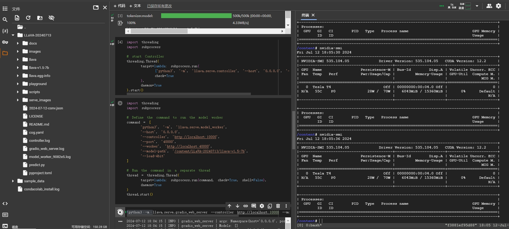

# LLaVA Colab Notebooks

## Introduction

This repository contains Google Colab notebooks for running different models of LLaVA, which enhance vision-language understanding using advanced large language models. For more information on the original models, refer to the LLaVA papers and the [official GitHub repository](https://github.com/haotian-liu/LLaVA).

- **LLaVA: Visual Instruction Tuning** ([arXiv link](https://arxiv.org/abs/2304.08485))
- **LLaVA 1.5: Improved Baselines with Visual Instruction Tuning** ([arXiv link](https://arxiv.org/abs/2310.03744))
- **LLaVA 1.6: LLaVA-NeXT: Improved Reasoning, OCR, and World Knowledge** ([Blog link](https://llava-vl.github.io/blog/2024-01-30-llava-next/))

## Notebooks

### LLaVA 1.5
1. [llava-v1.5-7b-4bit-demo.ipynb](LLaVA-1.5/llava-v1.5-7b-4bit-demo.ipynb)
2. [llava-v1.5-7b-8bit-demo.ipynb](LLaVA-1.5/llava-v1.5-7b-8bit-demo.ipynb)

### LLaVA 1.6
1. [llava-v1.6-mistral-7b-4bit-demo.ipynb](LLaVA-1.6/llava-v1.6-mistral-7b-4bit-demo.ipynb)
2. [llava-v1.6-mistral-7b-8bit-demo.ipynb](LLaVA-1.6/llava-v1.6-mistral-7b-8bit-demo.ipynb)
3. [llava-v1.6-vicuna-7b-4bit-demo.ipynb](LLaVA-1.6/llava-v1.6-vicuna-7b-4bit-demo.ipynb)
4. [llava-v1.6-vicuna-7b-8bit-demo.ipynb](LLaVA-1.6/llava-v1.6-vicuna-7b-8bit-demo.ipynb)

## Usage

1. Open the notebook you want to run.
2. Follow the instructions provided in the notebook to execute the cells and test the models.

## Visual Results

### LLaVA 1.5

1. **LLaVA-1.5-vicuna-7b-4bit-demo Page Rendering**
    

2. **LLaVA-1.5-vicuna-7b-4bit-demo Memory Usage**
    

3. **LLaVA-1.5-vicuna-7b-8bit-demo Page Rendering**
    

4. **LLaVA-1.5-vicuna-7b-8bit-demo Memory Usage**
    

### LLaVA 1.6

1. **LLaVA-1.6-mistral-7b-4bit-demo Page Rendering**
    

2. **LLaVA-1.6-mistral-7b-4bit-demo Memory Usage**
    

3. **LLaVA-1.6-mistral-7b-8bit-demo Page Rendering**
    

4. **LLaVA-1.6-mistral-7b-8bit-demo Memory Usage**
    

5. **LLaVA-1.6-vicuna-7b-4bit-demo Page Rendering**
    

6. **LLaVA-1.6-vicuna-7b-4bit-demo Memory Usage**
    

7. **LLaVA-1.6-vicuna-7b-8bit-demo Page Rendering**
    

8. **LLaVA-1.6-vicuna-7b-8bit-demo Memory Usage**
    

## References

- **LLaVA: Visual Instruction Tuning** [arXiv paper](https://arxiv.org/abs/2304.08485)
- **LLaVA 1.5: Improved Baselines with Visual Instruction Tuning** [arXiv paper](https://arxiv.org/abs/2310.03744)
- **LLaVA 1.6: LLaVA-NeXT: Improved Reasoning, OCR, and World Knowledge** [Blog post](https://llava-vl.github.io/blog/2024-01-30-llava-next/)
- [LLaVA GitHub repository](https://github.com/haotian-liu/LLaVA)

## License

This project follows the licenses of the original repositories. For more details, please refer to the LICENSE file and the license files in the original repositories.
