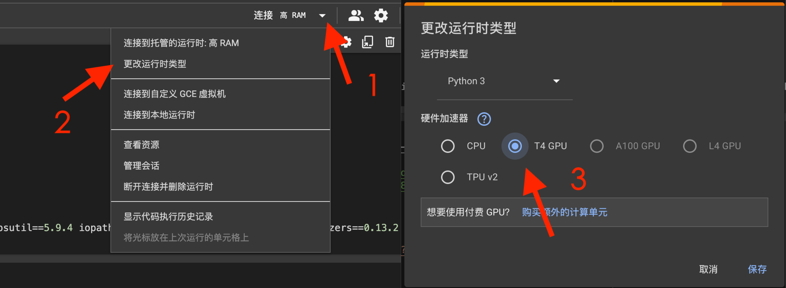
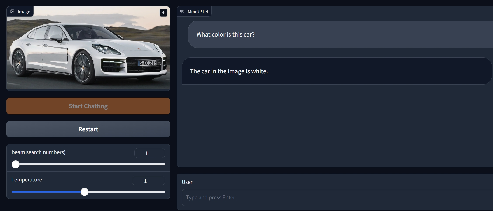
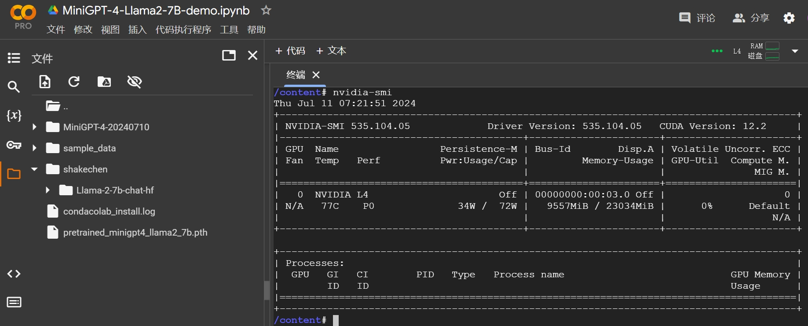
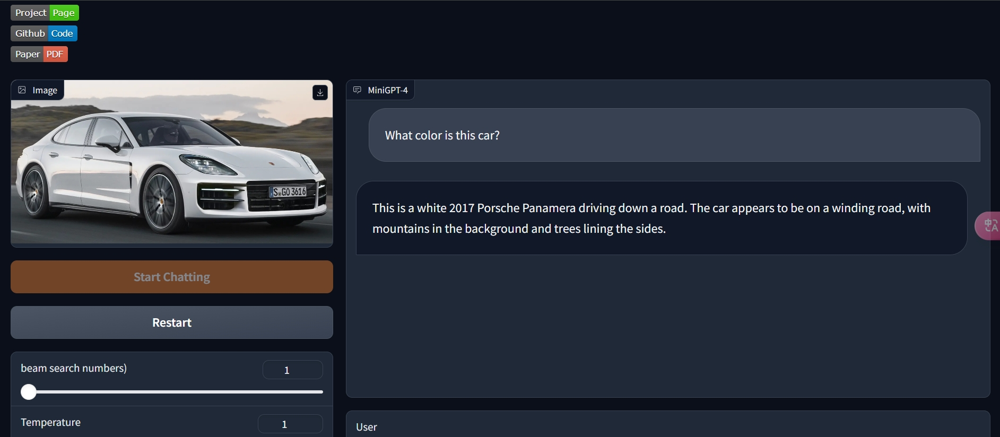
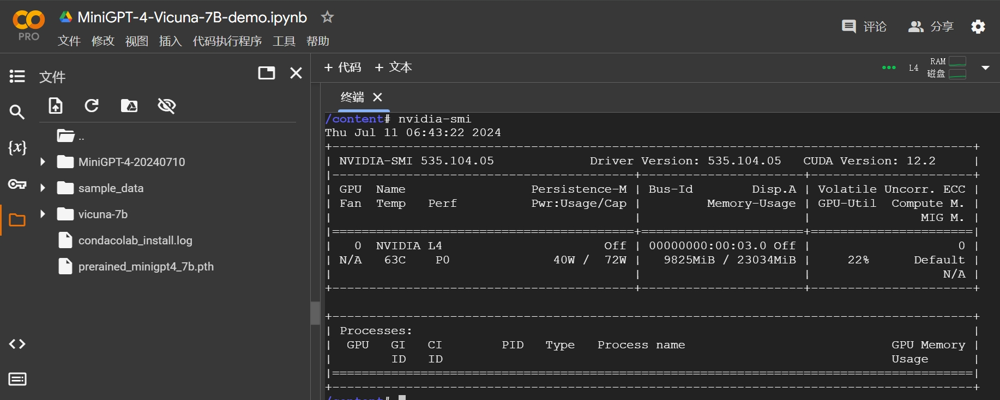
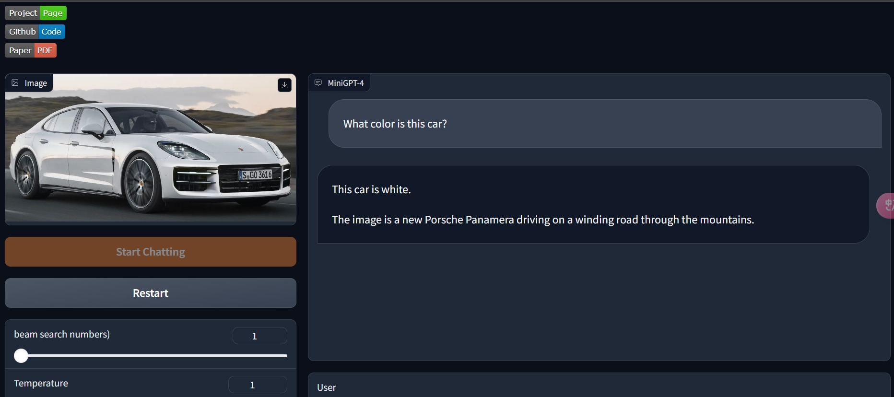
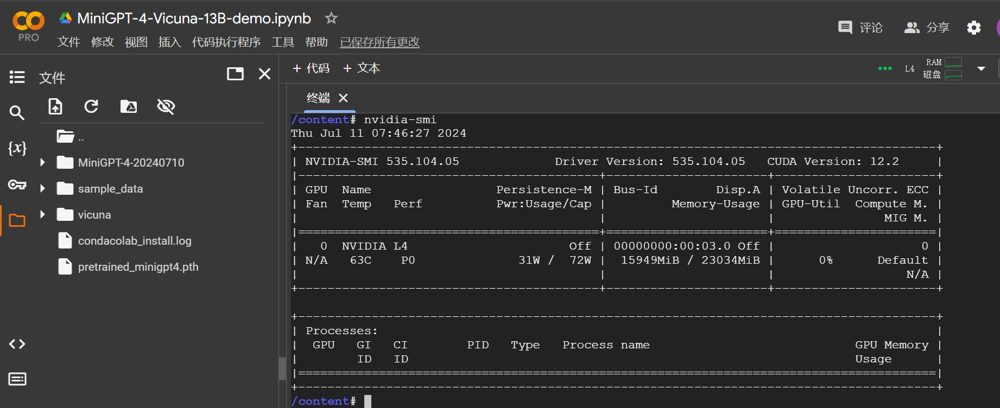

# MiniGPT-4 Colab Notebooks

## Introduction

This repository contains Google Colab notebooks for running different models of MiniGPT-4, which enhance vision-language understanding using advanced large language models. For more information on the original models, refer to the MiniGPT-4 paper titled **"[MiniGPT-4: Enhancing Vision-Language Understanding with Advanced Large Language Models](https://arxiv.org/abs/2304.10592)"** and the **[official GitHub repository](https://github.com/Vision-CAIR/MiniGPT-4)**.

## Notebooks

## Notebooks

| Notebook | Open in Colab |
|----------|---------------|
| [MiniGPT-4-Llama2-7B-demo.ipynb](MiniGPT-4-Llama2-7B-demo.ipynb) |  |
| [MiniGPT-4-Vicuna-7B-demo.ipynb](MiniGPT-4-Vicuna-7B-demo.ipynb) |  |
| [MiniGPT-4-Vicuna-13B-demo.ipynb](MiniGPT-4-Vicuna-13B-demo.ipynb) |  |

## Usage

1. Open the notebook you want to run.
2. Follow the instructions provided in the notebook to execute the cells and test the models.
3. To change the runtime type, follow these steps:
   
   - Click on the "Connect" button in the top right corner (marked as 1 in the image below).
   - Select "Change runtime type" from the dropdown menu (marked as 2 in the image below).
   - In the runtime type selection window, choose the hardware accelerator you want (marked as 3 in the image below) and click "Save".
   

## Visual Results

### Model Performance and Memory Usage

1. **MiniGPT-4-Llama2-7B-demo Page Rendering**
    

2. **MiniGPT-4-Llama2-7B-demo Memory Usage**
    

3. **MiniGPT-4-Vicuna-7B-demo Page Rendering**
    

4. **MiniGPT-4-Vicuna-7B-demo Memory Usage**
    

5. **MiniGPT-4-Vicuna-13B-demo Page Rendering**
    

6. **MiniGPT-4-Vicuna-13B-demo Memory Usage**
    

## License

This project follows the licenses of the original repositories. For more details, please refer to the LICENSE file and the license files in the original repositories.
